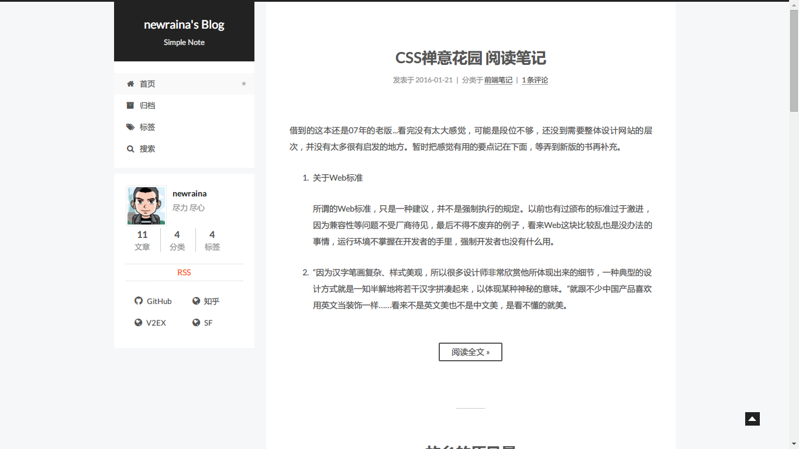

# NexT.Pisces

Hexo主题[NexT.Pisces](https://github.com/iissnan/hexo-theme-next)的Typecho移植版，基于[zgq354](http://blog.izgq.net/)的[NexT.Mist](https://github.com/zgq354/typecho-theme-next)修改制作

## 使用方法

1. 点击`download zip`下载最新源码，修改文件名为`NexTPisces`，解压上传
2. 后台启用
3. 新建分类页，缩略名为`categories`，自定义模板选择`categories`
4. 新建归档页，缩略名为`archive`，自定义模板选择`archives`
5. 新建标签页，缩略名为`tags`，自定义模板选择`tags`
6. 后台配置外观选项，包括头像、昵称、站点描述、侧边栏相关设置

## 注意事项

- 侧边栏友链只有在安装了 [Hanny](http://www.imhan.com/) 的 [Links插件](http://www.imhan.com/tag/%E5%8F%8B%E6%83%85%E9%93%BE%E6%8E%A5/) 才可显示，未安装不影响使用
